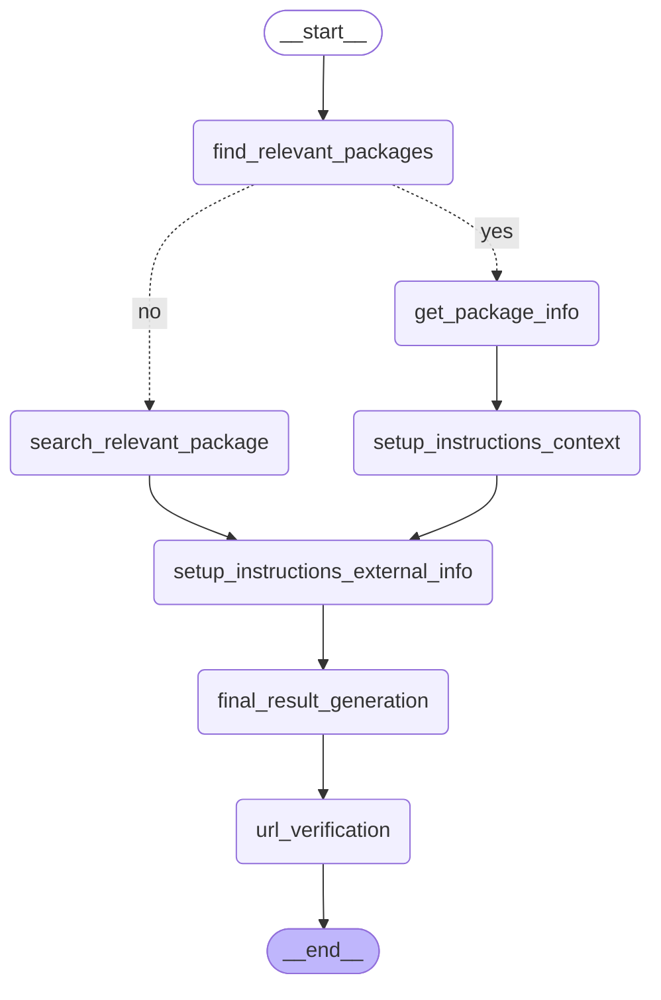

# System Info Workflow

A LangGraph-based workflow for generating comprehensive system documentation for third-party integrations using AI agents.

## Key Technologies

- **LangGraph**: Multi-agent workflow orchestration
- **Google Gemini**: AI models (Pro and Flash variants)
- **LangChain**: Agent creation and tool integration
- **Playwright**: JavaScript-rendered web page fetching
- **Arize Phoenix**: OpenTelemetry tracing and observability
- **DuckDuckGo**: Web search for finding documentation
- **Beautiful Soup**: HTML parsing and content extraction

## Features

- **Intelligent Package Matching**: Automatically finds relevant integration packages or searches for new ones
- **Context Extraction**: Analyzes integration documentation and manifests
- **External Research**: Searches for vendor setup instructions and best practices
- **AI-Powered Documentation**: Generates complete system documentation following Elastic standards
- **Context-Aware URL Verification**: Validates URLs with JavaScript rendering support
- **Observability**: Built-in Phoenix (Arize) tracing for monitoring workflow execution

## Requirements

- Python 3.13.x
- [uv](https://github.com/astral-sh/uv) package manager
- Docker (optional, for Phoenix observability)

## Setup

### 1. Install Dependencies

```bash
uv sync
```

### 2. Install Playwright Browsers

After installing the Python dependencies, you need to install the Playwright browser binaries:

```bash
playwright install chromium
```

This installs the Chromium browser required for JavaScript-rendered page fetching.

### 3. Environment Variables

Create a `.env` file in the project root with the following variables:

```env
# Google Gemini API Configuration (Required)
GEMINI_API_KEY=your_api_key_here

# Model Configuration (Optional - defaults shown)
GEMINI_PRO_MODEL=gemini-2.5-pro
GEMINI_FLASH_MODEL=gemini-2.5-flash

# Integration Root Path (Required)
INTEGRATION_ROOT_PATH=/path/to/integrations

# Debug Mode (Optional - shows detailed logging)
DEBUG=false
```

### 4. Phoenix Observability (Optional)

This project uses [Arize Phoenix](https://phoenix.arize.com/) for tracing and observability. To enable it:

```bash
# Start Phoenix server using the provided script
./start-phoenix.sh

# Or manually with Docker
docker run -p 6006:6006 -p 4317:4317 arizephoenix/phoenix:latest
```

Access the Phoenix UI at `http://localhost:6006` to monitor workflow execution, LLM calls, and agent interactions.

## Usage

Run the workflow with a product name:

```bash
python main.py --product <product_name>
```

Examples:

```bash
# For existing integrations
python main.py --product cisco_ise
python main.py --product checkpoint

# For new integrations (experimental)
python main.py --product "Project Discovery Cloud"
python main.py --product "PfSense Firewall"
```

## URL Verification

The workflow includes an intelligent URL verifier that:

### Key Features:
- **JavaScript Rendering**: Uses Playwright to fetch content from JavaScript-rendered pages
- **Context-Aware Validation**: Applies different validation rules based on the section where URLs appear
- **Section-Based Criteria**:
  - **Product Info Sections**: Allow general product information pages
  - **Setup Sections**: Require actual logging/syslog setup instructions
  - **Documentation Sections**: Keep relevant documentation and reference materials
  - **Troubleshooting Sections**: Keep troubleshooting and error resolution pages

### URL Validation Rules:

1. **elastic.co domains**: Always kept if status code is 200
2. **Product Info/Overview sections**: General product pages are acceptable
3. **Setup/Configuration sections**: Must contain logging setup instructions (strict validation)
4. **Documentation sections**: Must be relevant documentation or reference material
5. **Broken links**: Always removed (non-200 status codes)

### How It Works:

1. Extracts section context for each URL in the document
2. Fetches actual page content using a headless browser (handles JavaScript)
3. Applies validation rules based on section type and content
4. Removes invalid URLs while preserving document formatting

## Output

The workflow generates a comprehensive markdown file in the `output/` directory named `service_info-{integration_name}.md`.

### Output Structure

```markdown
# Service Info
- Common use cases
- Data types collected
- Compatibility
- Scaling and Performance

# Set Up Instructions
- Vendor prerequisites
- Elastic prerequisites
- Vendor set up steps (with verified URLs)
- Kibana set up steps

# Validation Steps
- Steps to verify the integration is working

# Troubleshooting
- Common Configuration Issues
- Ingestion Errors
- API Authentication Errors
- Vendor Resources (with verified URLs)

# Documentation sites
- List of verified documentation URLs
```

### URL Verification

All URLs in the generated documentation are automatically verified using the `url_verification_node`. Invalid URLs (broken links, timeouts, irrelevant content) are automatically removed while preserving document formatting.

## Architecture

The workflow uses LangGraph with the following nodes and AI agents:

### Workflow Nodes

1. **`find_relevant_packages_node`**: Matches user input to existing integration packages using Gemini Flash
2. **`get_package_info_node`**: Loads integration manifest (YAML) and documentation (README.md)
3. **`search_relevant_package_node`**: (Experimental) Searches for new integrations not in local packages using `search_relevant_package_agent`
4. **`setup_instructions_context_node`**: Extracts structured information from integration docs using `setup_instructions_context_agent`
5. **`setup_instructions_external_info_node`**: Searches web for vendor setup instructions using `setup_instructions_external_info_agent`
6. **`final_result_generation_node`**: Generates comprehensive documentation following Elastic template using `final_result_generation_agent`
7. **`url_verification_node`**: Verifies and validates all URLs with context awareness using `url_verifier_agent`

### AI Agents

- **`search_relevant_package_agent`** (Flash): Identifies package names for new integrations
  - Tools: `web_search_tool`
  
- **`setup_instructions_context_agent`** (Pro): Extracts structured info from integration docs
  - Tools: `web_search_tool`
  
- **`setup_instructions_external_info_agent`** (Pro): Researches vendor logging setup instructions
  - Tools: `web_search_tool`, `fetch_url_content`, `summarize_for_logging_setup`
  - **⚠️ Mandatory Tool Usage**: This agent MUST use all three tools in sequence for every request
  - Workflow: Search → Fetch full content → AI-powered summarization → Generate instructions
  - **Agentic**: Uses AI to understand and extract relevant content, not hardcoded patterns
  
- **`final_result_generation_agent`** (Flash): Generates complete documentation
  - Tools: `web_search_tool`
  
- **`url_verifier_agent`** (Flash): Validates URLs with context-aware rules
  - Tools: `fetch_url_content`, `extract_url_context`

### Tools

- **`web_search_tool`**: DuckDuckGo search for finding documentation
- **`fetch_url_content`**: Playwright-based URL fetcher handling JavaScript-rendered pages
- **`summarize_for_logging_setup`**: 🤖 **AI-powered intelligent summarizer** for extracting relevant content
  - Uses LLM (Gemini Flash) to understand context and extract relevant information
  - Analyzes documentation for logging/syslog setup instructions
  - Returns structured output: summary, setup_instructions, configuration_details
  - Checks content relevance automatically (has_relevant_content flag)
  - Supports custom focus areas (e.g., "API integration", "rsyslog configuration")
  - **Agentic approach** - no hardcoded keywords, adapts to any documentation style
- **`extract_url_context`**: Extracts markdown section context for URLs

### Workflow Logic



## Troubleshooting

### Playwright Installation Issues

If you encounter issues with Playwright, try:

```bash
# Reinstall Playwright browsers
playwright install --force chromium

# Or install all browsers
playwright install
```

### Browser Launch Errors

If the browser fails to launch, ensure you have the necessary system dependencies:

- **macOS**: Should work out of the box
- **Linux**: May need `libgbm`, `libnss3`, `libxss1`, etc.
- **Windows**: Should work out of the box

### Timeout Issues

If pages are timing out, you can modify the timeout in `workflow/tools.py`:

```python
response = page.goto(url, timeout=30000, wait_until='networkidle')  # 30 seconds
```

## Project Structure

```
workflows/
├── main.py                    # Entry point - runs the workflow and saves output
├── pyproject.toml            # Project dependencies (managed by uv)
├── start-phoenix.sh          # Script to start Phoenix observability server
├── .env                      # Environment variables (create this)
└── workflow/
    ├── __init__.py           # Package initialization and exports
    ├── agents.py             # AI agent definitions
    ├── constants.py          # Configuration and LLM instances
    ├── graph.py              # LangGraph workflow definition
    ├── nodes.py              # Workflow node implementations
    ├── prompts.py            # System prompts and prompt templates
    ├── state.py              # Workflow state definition
    └── tools.py              # Custom tools (fetch_url_content, extract_url_context)
```

## Development

### Debug Mode

To enable debug mode, set `DEBUG=true` in your `.env` file. This will show detailed logging from the LangGraph agents and print the workflow graph in ASCII format.

```bash
DEBUG=true python main.py --product cisco_ise
```

### Observability

The workflow is instrumented with Phoenix OpenTelemetry tracing. When Phoenix is running, you can:

- Monitor LLM calls and token usage
- Trace agent execution paths
- Debug tool invocations
- Analyze workflow performance

### Model Configuration

The workflow uses two Google Gemini models:

- **Gemini Pro** (`gemini-2.5-pro`): Used for complex tasks (context extraction, external research)
- **Gemini Flash** (`gemini-2.5-flash`): Used for faster tasks (package matching, documentation generation, URL verification)

You can override these in your `.env` file to use different models.

## How It Works

### Workflow Execution

1. **User Input**: User provides a product/integration name via command line argument
2. **Package Matching**: System searches for existing integration package or identifies new one
3. **Context Extraction**: 
   - For existing integrations: Reads manifest.yml and README.md
   - For new integrations: Searches web for basic information
4. **External Research**: Agent **mandatorily** uses web search and AI-powered content analysis to find vendor logging/setup documentation
   - Step 4a: Uses `web_search_tool` to find official documentation
   - Step 4b: Uses `fetch_url_content` to extract full page content from top results
   - Step 4c: Uses `summarize_for_logging_setup` (AI-powered) to intelligently extract relevant sections
   - The AI understands context and adapts to any documentation style
   - This ensures all setup instructions are based on real vendor documentation with intelligent filtering
5. **Documentation Generation**: Combines all information using Elastic documentation template
6. **URL Verification**: Validates all URLs in generated documentation with context-aware rules
   - Uses `fetch_url_content` to verify each URL is accessible and relevant
   - Uses `extract_url_context` to apply section-specific validation rules
7. **Output**: Saves verified markdown file to `output/` directory

### Integration Paths

**Path A: Existing Integration**
```
User Input → Find Package (Match Found) → Load Manifest & Docs → Extract Context 
→ Search External Info → Generate Docs → Verify URLs → Save
```

**Path B: New Integration (Experimental)**
```
User Input → Find Package (No Match) → Search Package Name → Search External Info 
→ Generate Docs → Verify URLs → Save
```

## Notes

- **Internet Connection Required**: The workflow requires an internet connection for web searches and URL verification
- **Tool Usage**: The `setup_instructions_external_info_agent` is configured to **always** use web search and content fetching tools - it will not generate responses without first researching actual vendor documentation
- **Processing Time**: Varies based on the number of URLs to verify (typically 2-5 minutes)
- **Integration Path**: The `INTEGRATION_ROOT_PATH` should point to an Elastic integrations repository clone
- **Observability**: Phoenix tracing is optional but highly recommended for debugging and monitoring tool usage
- **JavaScript Support**: URL verification uses a headless browser, so it can handle JavaScript-heavy pages
- **Content Accuracy**: All setup instructions are generated from actual vendor documentation content, not from AI knowledge alone

## License

This project is for internal use at Elastic for generating integration documentation.

