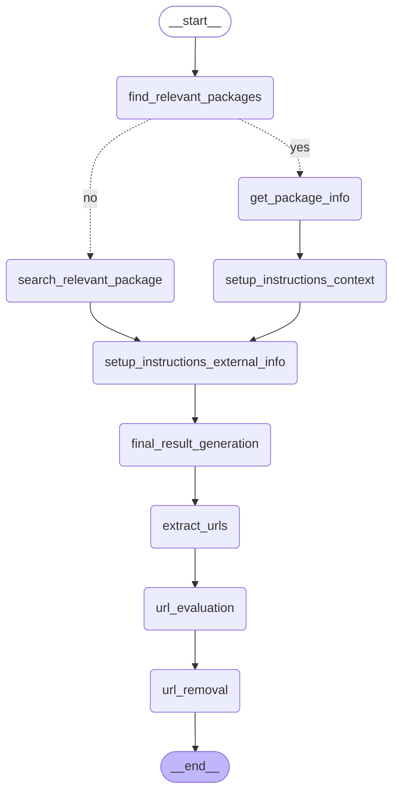

# System Info Workflow

A LangGraph-based workflow for generating comprehensive system documentation for third-party integrations using AI agents.

## Key Technologies

- **LangGraph**: Multi-agent workflow orchestration
- **Google Gemini**: AI models (Pro and Flash variants)
- **LangChain**: Agent creation and tool integration
- **Playwright**: JavaScript-rendered web page fetching
- **Arize Phoenix**: OpenTelemetry tracing and observability
- **DuckDuckGo**: Web search for finding documentation
- **Beautiful Soup**: HTML parsing and content extraction

## Features

- **Intelligent Package Matching**: Automatically finds relevant integration packages or searches for new ones
- **Context Extraction**: Analyzes integration documentation and manifests
- **External Research**: Searches for vendor setup instructions and best practices
- **AI-Powered Documentation**: Generates complete system documentation following Elastic standards
- **Parallel URL Verification**: Validates URLs concurrently with context-aware rules and JavaScript rendering support
- **Observability**: Built-in Phoenix (Arize) tracing for monitoring workflow execution

## Requirements

- Python 3.13.x
- [uv](https://github.com/astral-sh/uv) package manager
- Docker (optional, for Phoenix observability)

## Setup

### 1. Install Dependencies

```bash
uv sync
```

### 2. Install Playwright Browsers

After installing the Python dependencies, install the Playwright browser binaries:

```bash
playwright install chromium
```

### 3. Environment Variables

Create a `.env` file in the project root:

```env
# Google Gemini API Configuration (Required)
GEMINI_API_KEY=your_api_key_here

# Model Configuration (Optional - defaults shown)
GEMINI_PRO_MODEL=gemini-2.5-pro
GEMINI_FLASH_MODEL=gemini-2.5-flash

# Integration Root Path (Required)
INTEGRATION_ROOT_PATH=/path/to/integrations

# Debug Mode (Optional)
DEBUG=false
```

### 4. Phoenix Observability (Optional)

Start [Arize Phoenix](https://phoenix.arize.com/) for tracing:

```bash
./start-phoenix.sh

# Or manually with Docker
docker run -p 6006:6006 -p 4317:4317 arizephoenix/phoenix:latest
```

Access Phoenix UI at `http://localhost:6006`.

## Usage

```bash
uv run python main.py --product <product_name>
```

**Examples:**

```bash
# Existing integrations
uv run python main.py --product cisco_ise
uv run python main.py --product checkpoint

# New integrations (experimental)
uv run python main.py --product "Project Discovery Cloud"
```

## Architecture

### Workflow Nodes

| Node | Description |
|------|-------------|
| `find_relevant_packages` | Matches user input to existing integration packages |
| `get_package_info` | Loads integration manifest and documentation |
| `search_relevant_package` | (Experimental) Searches for new integrations not in local packages |
| `setup_instructions_context` | Extracts structured information from integration docs |
| `setup_instructions_external_info` | Searches web for vendor setup instructions |
| `final_result_generation` | Generates comprehensive documentation |
| `extract_urls` | Extracts all URLs from generated documentation |
| `url_evaluation` | Evaluates URLs in parallel for validity and relevance |
| `url_removal` | Removes invalid URLs from final documentation |

### AI Agents

| Agent | Model | Tools | Purpose |
|-------|-------|-------|---------|
| `setup_instructions_external_info_agent` | Pro | `web_search_tool`, `fetch_url_content_tool`, `summarize_for_logging_setup` | Researches vendor logging setup instructions |
| `setup_instructions_context_agent` | Pro | `web_search_tool` | Extracts structured info from integration docs |
| `search_relevant_package_agent` | Flash | `web_search_tool` | Identifies package names for new integrations |
| `final_result_generation_agent` | Flash | `web_search_tool` | Generates complete documentation |

### Tools

| Tool | Description |
|------|-------------|
| `web_search_tool` | DuckDuckGo search for finding documentation |
| `fetch_url_content_tool` | Playwright-based URL fetcher handling JavaScript-rendered pages |
| `summarize_for_logging_setup` | AI-powered intelligent summarizer for extracting relevant content from vendor docs |

### Utility Functions

Located in `workflow/utils.py`:

| Function | Description |
|----------|-------------|
| `fetch_url_content` | Core implementation for fetching URL content with Playwright |
| `extract_urls_from_markdown` | Extracts all URLs from markdown content |
| `evaluate_single_url` | Evaluates a single URL for validity and relevance |
| `evaluate_urls_parallel` | Parallel URL evaluation using LangChain's batch execution |

### Workflow Graph



## URL Verification Pipeline

The workflow includes a 3-stage parallel URL verification pipeline:

### Stage 1: Extract URLs (`extract_urls_node`)
Programmatically extracts all URLs from the generated markdown documentation.

### Stage 2: Evaluate URLs (`url_evaluation_node`)
Evaluates URLs in parallel using LangChain's batch execution:
- Fetches content with Playwright (handles JavaScript)
- Determines section context (setup, documentation, troubleshooting, etc.)
- Applies context-aware validation rules
- Uses LLM to evaluate content relevance

### Stage 3: Remove Invalid URLs (`url_removal_node`)
Removes URLs marked for removal while preserving document formatting.

### Validation Rules

| Section Type | Criteria |
|--------------|----------|
| **Product Info** | General product information pages acceptable |
| **Setup** | Must contain logging/syslog setup instructions (strict) |
| **Documentation** | Must be relevant documentation or reference material |
| **Troubleshooting** | Must contain troubleshooting information |

**Special Rules:**
- `elastic.co` domains: Always kept if status 200
- Non-200 status codes: Always removed (broken links)

## Output

Generated documentation is saved to `output/service_info-{integration_name}.md`:

```markdown
# Service Info
- Common use cases
- Data types collected
- Compatibility
- Scaling and Performance

# Set Up Instructions
- Vendor prerequisites
- Elastic prerequisites
- Vendor set up steps
- Kibana set up steps

# Validation Steps

# Troubleshooting
- Common Configuration Issues
- Ingestion Errors
- API Authentication Errors
- Vendor Resources

# Documentation sites
```

## Project Structure

```
workflows/
├── main.py                 # Entry point
├── pyproject.toml          # Dependencies (managed by uv)
├── start-phoenix.sh        # Phoenix observability server script
├── .env                    # Environment variables
├── output/                 # Generated documentation
└── workflow/
    ├── __init__.py         # Package exports
    ├── agents.py           # AI agent definitions
    ├── constants.py        # Configuration and LLM instances
    ├── graph.py            # LangGraph workflow definition
    ├── nodes.py            # Workflow node implementations
    ├── prompts.py          # System prompts and templates
    ├── state.py            # Workflow state definition
    ├── tools.py            # LangChain tools (@tool decorated)
    └── utils.py            # Utility functions (URL fetching, evaluation)
```

## Development

### Debug Mode

```bash
DEBUG=true uv run python main.py --product cisco_ise
```

### Model Configuration

| Model | Default | Used For |
|-------|---------|----------|
| Gemini Pro | `gemini-2.5-pro` | Complex tasks (context extraction, external research) |
| Gemini Flash | `gemini-2.5-flash` | Fast tasks (package matching, documentation generation) |

## Troubleshooting

### Playwright Issues

```bash
# Reinstall browsers
playwright install --force chromium

# Or install all browsers
playwright install
```

### Browser Launch Errors

- **macOS/Windows**: Should work out of the box
- **Linux**: May need `libgbm`, `libnss3`, `libxss1`, etc.

### Timeout Issues

Modify timeout in `workflow/utils.py`:

```python
response = page.goto(url, timeout=30000, wait_until='networkidle')  # 30 seconds
```

## Notes

- **Internet Required**: Web searches and URL verification require internet access
- **Processing Time**: 2-5 minutes depending on URL count
- **Integration Path**: `INTEGRATION_ROOT_PATH` should point to an Elastic integrations repository
- **JavaScript Support**: URL verification handles JavaScript-heavy pages via headless browser
